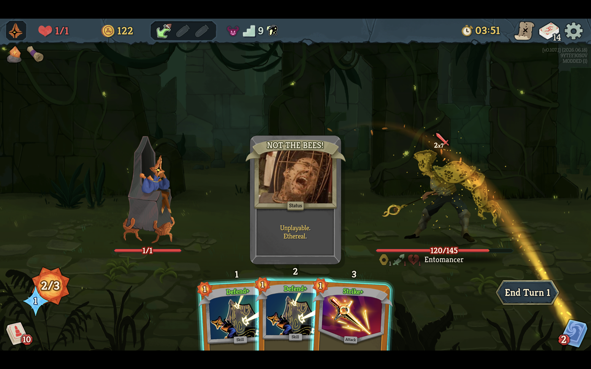

# STS2_NotTheBees

A cosmetic Slay the Spire 2 mod. When the **Entomancer** elite shuffles **Dazed**
status cards into your deck, each one becomes Nic Cage screaming under a cage of
bees (*The Wicker Man*, 2006): renamed to **NOT THE BEES!** with the meme image as
its art. No gameplay changes.



*The Entomancer's Dazed, mid-fight. Dazed from any other source stays a normal Dazed.*

## How it works

Three HarmonyLib prefix patches (Harmony id `com.sts2notthebees`). There is one
shared `Dazed` card model, so the mod first identifies the Entomancer's copies,
then reflavors only those:

- **Tag** — prefix on `CardPileCmd.AddGeneratedCardToCombat`: when a `Dazed` is
  added to combat and `PersonalHivePower` (the Entomancer's power, whose move is
  literally `BEES_MOVE`) is on the call stack, the card instance is recorded in a
  `ConditionalWeakTable`.
- **Rename** — prefix on `CardModel.Title`: returns `NOT THE BEES!` for tagged
  instances only.
- **Reface** — prefix on `CardModel.Portrait`: returns the bundled
  `not-the-bees.png` for tagged instances only.

Every other card — and every Dazed the Entomancer did not create — passes through
untouched.

## Build

Requires the .NET SDK and a local STS2 install.

```bash
export DOTNET_ROOT="/opt/homebrew/Cellar/dotnet/10.0.107/libexec"
dotnet build -c Release \
  -p:STS2GameDir="/Users/brian/Library/Application Support/Steam/steamapps/common/Slay the Spire 2"
```

## Install

```bash
./install.sh
```

Copies the DLL, `STS2_NotTheBees.json`, and `not-the-bees.png` into the
game's `SlayTheSpire2.app/Contents/MacOS/mods/` folder. Restart the game.

## Swapping the image

Replace `assets/not-the-bees.png` with any PNG and re-run `./install.sh`.
